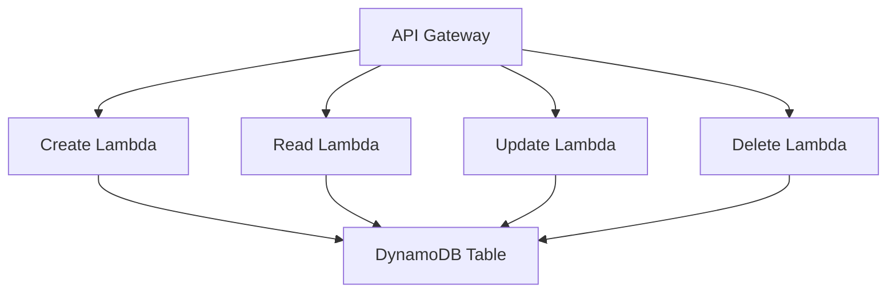

# Design Document

## Overview

This system implements a serverless CRUD API using AWS Lambda functions, API Gateway, and DynamoDB. The architecture consists of four independent Lambda functions (Create, Read, Update, Delete) that handle JSON data with comprehensive validation and error handling. Each function will be implemented using Python 3.12 (AWS Lambda's latest supported version) and will communicate with DynamoDB for data persistence.

## Architecture

### High-Level Architecture



### API Gateway Configuration

- **Base Path**: `/api/v1`
- **Endpoints**:
  - `POST /items` → Create Lambda
  - `GET /items/{id}` → Read Lambda (single item)
  - `GET /items` → Read Lambda (all items)
  - `PUT /items/{id}` → Update Lambda
  - `DELETE /items/{id}` → Delete Lambda

### Lambda Functions Architecture

Each Lambda function follows a consistent structure:
1. **Input Validation Layer**: Validates incoming JSON data
2. **Business Logic Layer**: Processes the validated data
3. **Data Access Layer**: Interacts with DynamoDB
4. **Response Layer**: Formats and returns JSON responses

## Components and Interfaces

### 1. Data Validation Module (`validation.py`)

**Purpose**: Centralized validation logic for all data types

**Key Functions**:
- `validate_item_data(data: dict) -> ValidationResult`
- `validate_required_fields(data: dict, required_fields: list) -> ValidationResult`
- `validate_data_types(data: dict, schema: dict) -> ValidationResult`

**Validation Schema**:
```python
ITEM_SCHEMA = {
    "id": {"type": "string", "required": True, "max_length": 50},
    "name": {"type": "string", "required": True, "max_length": 100},
    "description": {"type": "string", "required": False, "max_length": 500},
    "price": {"type": "float", "required": True, "min_value": 0.01},
    "quantity": {"type": "integer", "required": True, "min_value": 0},
    "is_active": {"type": "boolean", "required": True},
    "tags": {"type": "array", "required": False, "item_type": "string"},
    "metadata": {"type": "object", "required": False},
    "created_at": {"type": "string", "required": False, "format": "iso_datetime"},
    "updated_at": {"type": "string", "required": False, "format": "iso_datetime"}
}
```

### 2. DynamoDB Access Module (`dynamodb_client.py`)

**Purpose**: Handles all DynamoDB operations with error handling

**Key Functions**:
- `create_item(item_data: dict) -> dict`
- `get_item(item_id: str) -> dict`
- `get_all_items() -> list`
- `update_item(item_id: str, item_data: dict) -> dict`
- `delete_item(item_id: str) -> bool`

**Configuration**:
- Table Name: `crud-api-items`
- Primary Key: `id` (String)
- Indexes: None (simple table structure)

### 3. Response Handler Module (`response_handler.py`)

**Purpose**: Standardizes API responses and error handling

**Key Functions**:
- `success_response(data: dict, status_code: int = 200) -> dict`
- `error_response(message: str, error_code: str, status_code: int) -> dict`
- `validation_error_response(errors: list) -> dict`

**Response Format**:
```python
# Success Response
{
    "success": True,
    "data": {...},
    "message": "Operation completed successfully"
}

# Error Response
{
    "success": False,
    "error": {
        "code": "VALIDATION_ERROR",
        "message": "Validation failed",
        "details": [...]
    }
}
```

### 4. Lambda Function Handlers

#### Create Lambda (`create_handler.py`)
- Validates incoming JSON data
- Generates unique ID and timestamps
- Stores item in DynamoDB
- Returns created item data

#### Read Lambda (`read_handler.py`)
- Handles both single item and list all items requests
- Validates item ID format for single item requests
- Returns formatted item data

#### Update Lambda (`update_handler.py`)
- Validates incoming JSON data
- Checks if item exists
- Updates item in DynamoDB with new timestamp
- Returns updated item data

#### Delete Lambda (`delete_handler.py`)
- Validates item ID format
- Checks if item exists
- Removes item from DynamoDB
- Returns deletion confirmation

## Data Models

### Item Model

The system will handle a comprehensive item model that demonstrates all JSON data types:

```python
{
    "id": "string",                    # Primary key, UUID format
    "name": "string",                  # Item name
    "description": "string",           # Optional description
    "price": 99.99,                    # Float/decimal value
    "quantity": 100,                   # Integer value
    "is_active": true,                 # Boolean value
    "tags": ["tag1", "tag2"],         # Array of strings
    "metadata": {                      # Nested object
        "category": "electronics",
        "weight": 1.5,
        "dimensions": {
            "length": 10,
            "width": 5,
            "height": 3
        }
    },
    "created_at": "2024-01-01T00:00:00Z",  # ISO datetime string
    "updated_at": "2024-01-01T00:00:00Z"   # ISO datetime string
}
```

### DynamoDB Table Structure

```python
{
    "TableName": "crud-api-items",
    "KeySchema": [
        {
            "AttributeName": "id",
            "KeyType": "HASH"
        }
    ],
    "AttributeDefinitions": [
        {
            "AttributeName": "id",
            "AttributeType": "S"
        }
    ],
    "BillingMode": "PAY_PER_REQUEST"
}
```

## Error Handling

### Error Categories

1. **Validation Errors (400)**
   - Missing required fields
   - Invalid data types
   - Value out of range
   - Invalid format

2. **Not Found Errors (404)**
   - Item does not exist
   - Invalid item ID

3. **Server Errors (500)**
   - DynamoDB connection issues
   - Unexpected exceptions
   - AWS service errors

### Error Response Structure

```python
{
    "success": False,
    "error": {
        "code": "ERROR_CODE",
        "message": "Human readable error message",
        "details": [
            {
                "field": "field_name",
                "message": "Specific field error"
            }
        ]
    },
    "timestamp": "2024-01-01T00:00:00Z"
}
```

### Exception Handling Strategy

1. **Try-Catch Blocks**: Wrap all operations in try-catch blocks
2. **Logging**: Log all errors with context for debugging
3. **Graceful Degradation**: Return meaningful error messages
4. **Status Codes**: Use appropriate HTTP status codes

## Testing Strategy

### Unit Testing

1. **Validation Module Tests**
   - Test all data type validations
   - Test required field validations
   - Test edge cases and boundary conditions

2. **DynamoDB Client Tests**
   - Mock DynamoDB operations
   - Test error scenarios
   - Test data transformation

3. **Response Handler Tests**
   - Test response formatting
   - Test error response generation
   - Test status code assignment

### Integration Testing

1. **Lambda Function Tests**
   - Test complete request-response cycle
   - Test with various input scenarios
   - Test error handling paths

2. **API Gateway Integration**
   - Test endpoint routing
   - Test request/response transformation
   - Test CORS handling

### Test Data

Create comprehensive test datasets that include:
- All supported JSON data types
- Edge cases (empty arrays, null values)
- Invalid data scenarios
- Large payload testing

### Performance Testing

1. **Load Testing**: Test Lambda cold start and warm execution
2. **Concurrency Testing**: Test multiple simultaneous requests
3. **DynamoDB Performance**: Test read/write capacity scaling

## Security Considerations

1. **Input Sanitization**: Validate and sanitize all input data
2. **IAM Roles**: Minimal permissions for Lambda functions
3. **API Gateway**: Rate limiting and throttling
4. **Data Encryption**: Enable encryption at rest for DynamoDB
5. **Logging**: Avoid logging sensitive data

## Deployment Configuration

### Lambda Function Configuration

```python
{
    "Runtime": "python3.12",
    "Handler": "lambda_function.lambda_handler",
    "Timeout": 30,
    "MemorySize": 256,
    "Environment": {
        "Variables": {
            "DYNAMODB_TABLE_NAME": "crud-api-items",
            "AWS_REGION": "us-east-1"
        }
    }
}
```

### Required AWS Permissions

```json
{
    "Version": "2012-10-17",
    "Statement": [
        {
            "Effect": "Allow",
            "Action": [
                "dynamodb:GetItem",
                "dynamodb:PutItem",
                "dynamodb:UpdateItem",
                "dynamodb:DeleteItem",
                "dynamodb:Scan"
            ],
            "Resource": "arn:aws:dynamodb:*:*:table/crud-api-items"
        },
        {
            "Effect": "Allow",
            "Action": [
                "logs:CreateLogGroup",
                "logs:CreateLogStream",
                "logs:PutLogEvents"
            ],
            "Resource": "arn:aws:logs:*:*:*"
        }
    ]
}
```